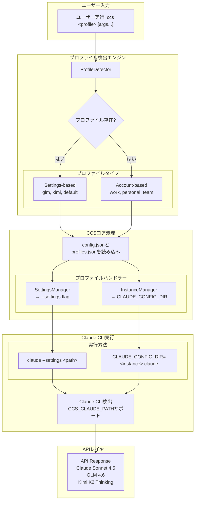

# CCS - Claude Code Switch

<div align="center">


**1コマンド、ダウンタイムなし、複数アカウント**

複数のClaudeアカウント、GLM、Kimiを瞬時に切り替え。<br>
レート制限を回避し、継続的に作業。


[](LICENSE)
[]()
[](https://www.npmjs.com/package/@kaitranntt/ccs)
[](https://claudekit.cc?ref=HMNKXOHN)

**Languages**: [English](README.md) | [Tiếng Việt](README.vi.md) | [日本語](README.ja.md)

</div>

---

## 🚀 クイックスタート

### 🔑 前提条件

**CCSをインストールする前に、サブスクリプションアカウントでClaude CLIにログインしていることを確認してください：**
```bash
claude /login
```

### 主なインストール方法

#### オプション1: npmパッケージ（推奨）

**macOS / Linux / Windows**
```bash
npm install -g @kaitranntt/ccs
```

主要なパッケージマネージャーすべてに対応：

```bash
# yarn
yarn global add @kaitranntt/ccs

# pnpm（ディスク使用量70%削減）
pnpm add -g @kaitranntt/ccs

# bun（30倍高速）
bun add -g @kaitranntt/ccs
```

#### オプション2: 直接インストール（従来型）

**macOS / Linux**
```bash
curl -fsSL ccs.kaitran.ca/install | bash
```

**Windows PowerShell**
```powershell
irm ccs.kaitran.ca/install | iex
```

> **💡 パフォーマンス**: 従来型インストールはNode.jsルーティングをバイパスし起動が高速ですが、デプロイ自動化が容易なためnpm更新を優先します。

### 設定（自動作成）

**CCSはインストール時に自動的に設定を作成します**（npm postinstallスクリプト経由）。

**~/.ccs/config.json**:
```json
{
  "profiles": {
    "glm": "~/.ccs/glm.settings.json",
    "glmt": "~/.ccs/glmt.settings.json",
    "kimi": "~/.ccs/kimi.settings.json",
    "default": "~/.claude/settings.json"
  }
}
```

### カスタムClaude CLIパス

Claude CLIが標準以外の場所（Dドライブ、カスタムディレクトリ）にインストールされている場合は、`CCS_CLAUDE_PATH`を設定してください：

```bash
export CCS_CLAUDE_PATH="/path/to/claude"              # Unix
$env:CCS_CLAUDE_PATH = "D:\Tools\Claude\claude.exe"   # Windows
```

**詳細な設定手順については、[トラブルシューティングガイド](./docs/en/troubleshooting.md#claude-cli-in-non-standard-location)を参照してください。**

### Windowsシンボリックリンクサポート（開発者モード）

**Windowsユーザー**: 本物のシンボリックリンクで高速な動作と即時同期を得るために開発者モードを有効にしてください：

1. **設定** → **プライバシーとセキュリティ** → **開発者向け** を開く
2. **開発者モード** を有効にする
3. CCSを再インストール: `npm install -g @kaitranntt/ccs`

**開発者モードなし**: CCSは自動的にディレクトリコピーにフォールバック（動作しますが、プロファイル間の即時同期はありません）

---

### 最初の切り替え

> **⚠️ 重要**: GLM、GLMT、Kimiプロファイルを使用する前に、設定ファイルでAPIキーを更新してください：
> - **GLM**: `~/.ccs/glm.settings.json`を編集してGLM APIキーを追加
> - **GLMT**: `~/.ccs/glmt.settings.json`を編集してZ.AI APIキーを追加（coding planが必要）
> - **Kimi**: `~/.ccs/kimi.settings.json`を編集してKimi APIキーを追加

```bash
# Claudeサブスクリプション（デフォルト）
ccs "マイクロサービスアーキテクチャの計画"

# GLMに切り替え（コスト最適化）
ccs glm "REST APIを作成"

# GLM with thinkingモード
ccs glmt "アルゴリズム問題を解決"

# Kimi for Coding
ccs kimi "統合テストを作成"
```

---

## 日常の開発者の課題

開発者は日々多くのサブスクリプションシナリオに直面します：

1. **アカウント分離**: 会社のClaudeアカウントと個人のClaude → 業務と個人のコンテキストを手動で切り替える必要
2. **レート制限**: Claudeがプロジェクト途中で停止 → 手動で`~/.claude/settings.json`を編集
3. **コスト管理**: 2-3つのProサブスクリプション（月$20） vs Claude Maxの5倍コスト（月$100）→ Pro階層が実用的な上限
4. **モデル選択**: タスクごとに異なるモデルの強みを活用 → 手動切り替え

手動コンテキスト切り替えはワークフローを中断します。**CCSがシームレスに管理します**。

## 手動切り替えではなくCCSを使う理由は？

<div align="center">

| 機能 | メリット |
|---------|---------|
| **アカウント分離** | 業務と個人を分離 |
| **コスト最適化** | 2-3つのProアカウント vs Max 5倍コスト |
| **即座の切り替え** | 1コマンド、ファイル編集不要 |
| **ゼロダウンタイム** | ワークフロー中断なし |
| **レート制限管理** | 制限時にアカウント切り替え |
| **クロスプラットフォーム** | macOS、Linux、Windows |

</div>

**ソリューション**:
```bash
ccs work          # 会社のClaudeアカウントを使用
ccs personal      # 個人Claudeアカウントに切り替え
ccs glm           # コスト効率の良いタスク用にGLMに切り替え
ccs kimi          # 代替オプション用にKimiに切り替え
# レート制限に達した？即座に切り替え：
ccs glm           # GLMで作業を続行
# 別の会社アカウントが必要？
ccs work-2        # 2番目の会社アカウントに切り替え
```

---

## 🏗️ アーキテクチャ概要

**v3.0 Login-Per-Profileモデル**: 各プロファイルは独立したClaudeインスタンスで、ユーザーが直接ログインします。資格情報のコピーやvault暗号化は不要です。



---

## Architecture

### Profile Types

**Settings-based**: GLM, GLMT, Kimi, default
- Uses `--settings` flag pointing to config files
- GLMT: Embedded proxy for thinking mode support

**Account-based**: work, personal, team
- Uses `CLAUDE_CONFIG_DIR` for isolated instances
- Create with `ccs auth create <profile>`

### Shared Data (v3.1)

Commands and skills symlinked from `~/.ccs/shared/` - no duplication across profiles.

```
~/.ccs/
├── shared/                  # Shared across all profiles
│   ├── agents/
│   ├── commands/
│   └── skills/
├── instances/               # Profile-specific data
│   └── work/
│       ├── agents@ → shared/agents/
│       ├── commands@ → shared/commands/
│       ├── skills@ → shared/skills/
│       ├── settings.json    # API keys, credentials
│       └── sessions/        # Conversation history
│       └── ...
```

**Shared**: commands/, skills/, agents/
**Profile-specific**: settings.json, sessions/, todolists/, logs/

**[i] Windows**: Copies dirs if symlinks unavailable (enable Developer Mode for true symlinks)

---

## GLM with Thinking (GLMT)

> **[!] 警告：本番環境未対応**
>
> **GLMTは実験的で広範なデバッグが必要です**：
> - ストリーミングとツールサポートはまだ開発中
> - 予期せぬエラー、タイムアウト、不完全な応答が発生する可能性
> - 頻繁なデバッグと手動介入が必要
> - **重要なワークフローや本番使用には推奨されません**
>
> **GLM Thinkingの代替案**: **CCR hustle**と**BedollaのTransformer**（ZaiTransformer）を通じて、より安定した実装を検討してください。
>
> **[!] 重要**: GLMTはnpmインストールが必要です（`npm install -g @kaitranntt/ccs`）。ネイティブシェルバージョンでは利用できません（Node.js HTTPサーバーが必要）。

### GLM vs GLMT

| 機能 | GLM (`ccs glm`) | GLMT (`ccs glmt`) |
|-----|-----------------|-------------------|
| **エンドポイント** | Anthropic互換 | OpenAI互換 |
| **思考** | なし | 実験的（reasoning_content） |
| **ツールサポート** | 基本的 | **不安定（v3.5+）** |
| **MCPツール** | 制限あり | **バグあり（v3.5+）** |
| **ストリーミング** | 安定 | **実験的（v3.4+）** |
| **TTFB** | <500ms | <500ms（時々）、2-10秒+（頻繁） |
| **使用例** | 信頼性の高い作業 | **デバッグ実験のみ** |

---

## ⚡ 機能

- **即座の切り替え** - `ccs glm`でGLMに切り替え、設定編集不要
- **同時セッション** - 複数のプロファイルを異なるターミナルで同時実行
- **独立したインスタンス** - 各プロファイルが独自の設定を保持 (`~/.ccs/instances/<profile>/`)
- **クロスプラットフォーム** - macOS、Linux、Windows - 同一動作
- **ダウンタイムなし** - 即座に切り替え、ワークフロー中断なし


---

## 💻 使用例

```bash
ccs              # Claudeサブスクリプション（デフォルト）
ccs glm          # GLM（thinkingなし）
ccs glmt         # GLM with thinking
ccs kimi         # Kimi for Coding
ccs --version    # バージョン表示
```

### 同時セッション (Multi-Account)
```bash
# 複数のClaudeアカウントを作成
ccs auth create work       # 業務用アカウント
ccs auth create personal   # 個人用アカウント
ccs auth create team       # チーム用アカウント

# ターミナル1 - 業務用アカウント
ccs work "implement feature"

# ターミナル2 - 個人用アカウント（同時実行）
ccs personal "review code"
```

---

### 🗑️ アンインストール

**パッケージマネージャー**
```bash
# npm
npm uninstall -g @kaitranntt/ccs

# yarn
yarn global remove @kaitranntt/ccs

# pnpm
pnpm remove -g @kaitranntt/ccs

# bun
bun remove -g @kaitranntt/ccs
```

**公式アンインストーラー**

**macOS / Linux**
```bash
curl -fsSL ccs.kaitran.ca/uninstall | bash
```

**Windows PowerShell**
```powershell
irm ccs.kaitran.ca/uninstall | iex
```

---

## 🎯 哲学

- **YAGNI**: 「念のため」の機能は追加しない
- **KISS**: シンプルなbash、複雑さなし
- **DRY**: 単一の情報源（設定）

---

## 📖 ドキュメント

**[docs/](./docs/)の完全なドキュメント**:
- [インストールガイド](./docs/en/installation.md)
- [設定](./docs/en/configuration.md)
- [使用例](./docs/en/usage.md)
- [System Architecture](./docs/system-architecture.md)
- [GLMT Control Mechanisms](./docs/glmt-controls.md)
- [トラブルシューティング](./docs/en/troubleshooting.md)
- [コントリビューション](./CONTRIBUTING.md)

---

## 🤝 コントリビューション

コントリビューションを歓迎します！詳細については[コントリビューションガイド](./CONTRIBUTING.md)をご覧ください。

---

## 📄 ライセンス

CCSは[MITライセンス](LICENSE)の下でライセンスされています。

---

<div align="center">

**レート制限に頻繁に遭遇する開発者のために ❤️ を込めて作成**

[⭐ このリポジトリにスター](https://github.com/kaitranntt/ccs) | [🐛 問題を報告](https://github.com/kaitranntt/ccs/issues) | [📖 ドキュメントを読む](./docs/en/)

</div>
